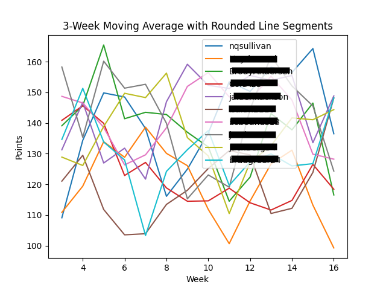

# Sleeper Analytics

## Description

Sleeper Analytics is a Python application designed to analyze and visualize data from the Sleeper fantasy football
platform. It uses various libraries such as numpy, pandas, requests, and matplotlib to fetch, process, and visualize the
data.

The application fetches player, roster, and matchup data from the Sleeper API and calculates various statistics such as
total points for and against, average points for and against, points difference, and efficiency. These statistics are
then saved to a CSV file for further analysis.

In addition to calculating statistics, the application also generates a plot of the 3-week moving average of points for
each team, excluding the last week. This plot is saved as a PNG file.

## How to Use

1. Clone the repository
2. Install the required packages using `pip install -r requirements.txt`
3. Run the application using `python main.py <league_id>`

## Example

This is for my dynasty league.
`python main.py 999090624546623488`

Here is the output: saved as `statistics.csv`

| Name      | wins | losses | win\_percentage | points\_for | points\_against | average\_points\_for | average\_points\_against | points\_difference | optimal\_points\_for | optimal\_points\_against | efficiency\_for | efficiency\_against |
|:----------|:-----|:-------|:----------------|:------------|:----------------|:---------------------|:-------------------------|:-------------------|:---------------------|:-------------------------|:----------------|:--------------------|
| privacy   | 10   | 4      | 71.43%          | 2304.22     | 2083.32         | 164.59               | 148.81                   | 220.9              | 2458.2               | 2342.86                  | 93.74%          | 88.92%              |
| privacy   | 9    | 5      | 64.29%          | 2276.82     | 2132.64         | 162.63               | 152.33                   | 144.18             | 2475.66              | 2399.16                  | 91.97%          | 88.89%              |
| privacy   | 8    | 6      | 57.14%          | 2266.58     | 2135.56         | 161.9                | 152.54                   | 131.02             | 2469.16              | 2399.54                  | 91.80%          | 89.00%              |
| Nathaniel | 8    | 6      | 57.14%          | 2193.9      | 2126.62         | 156.71               | 151.9                    | 67.28              | 2648.52              | 2360.2                   | 82.83%          | 90.10%              |
| privacy   | 6    | 8      | 42.86%          | 1943.28     | 1894.04         | 138.81               | 135.29                   | 49.24              | 2225.3               | 2286.54                  | 87.33%          | 82.83%              |
| privacy   | 9    | 5      | 64.29%          | 2157.24     | 2123.06         | 154.09               | 151.65                   | 34.18              | 2346.98              | 2362.02                  | 91.92%          | 89.88%              |
| privacy   | 6    | 8      | 42.86%          | 2185.84     | 2170.16         | 156.13               | 155.01                   | 15.68              | 2368.64              | 2297.6                   | 92.28%          | 94.45%              |
| privacy   | 4    | 10     | 28.57%          | 2141.76     | 2232.16         | 152.98               | 159.44                   | -90.4              | 2367.66              | 2536.22                  | 90.46%          | 88.01%              |
| privacy   | 5    | 9      | 35.71%          | 1963.16     | 2094.52         | 140.23               | 149.61                   | -131.36            | 2216.82              | 2396.8                   | 88.56%          | 87.39%              |
| privacy   | 5    | 9      | 35.71%          | 1873.44     | 2314.16         | 133.82               | 165.3                    | -440.72            | 2278.62              | 2474.62                  | 82.22%          | 93.52%              |

The 3-week moving average plot is saved as `rounded_line_moving_average.png`.

## Future Work

There is a lot more that could potentially be done with this application. Some ideas include:

- Adding more statistics such as standard deviation, variance, and median
- Adding more visualizations such as a box plot of points for and against
- Adding suggestions for potential trades or waiver wire pickups
- Adding a web interface for easier access
- Adding support for other fantasy sports platforms such as ESPN, Yahoo, and NFL (This could be problematic due to the
  lack of public APIs for these platforms)